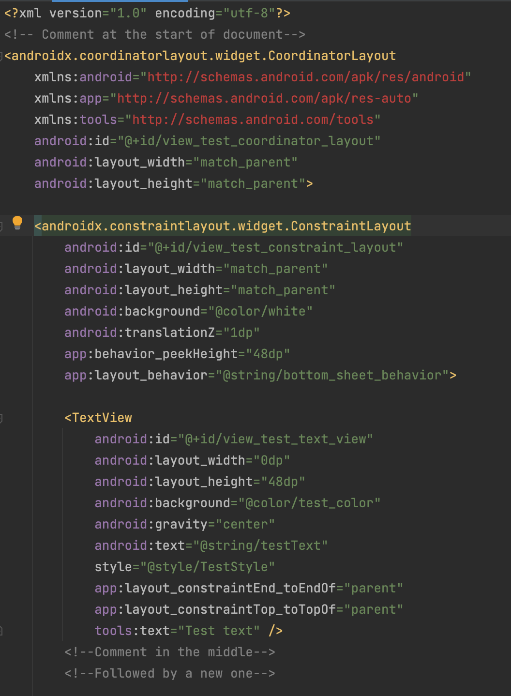

# PimpMyLayout

PimpMyLayout is a command client app that will style/format android layout xml files. 
Be aware that is in early stages of development.

## How do I use it?

Pre-requirements:
- java 8 installed.

Steps:

1. Get the latest jar from our [releases](https://github.com/franvis/PimpMyLayout/releases)
2. Run:
```bash
java -jar pimp-my-layout.jar pimp-my-layout-apply [ROOT DIRECTORY WITH FILES TO FORMAT]
```

## Demo
|Before | After using `PimpMyLayout`|
| ---- | ---- |
|  |  |

## External Technologies/Libraries used:
* [Ktfmt](https://github.com/facebookincubator/ktfmt)
* [JDOM](http://www.jdom.org/)
* [Clikt](https://ajalt.github.io/clikt/)

## Coming soon:
* Option to check if certain layouts are compliant with the PimpMyLayout code styling.
* Option to check and apply styling to drawable xml files
